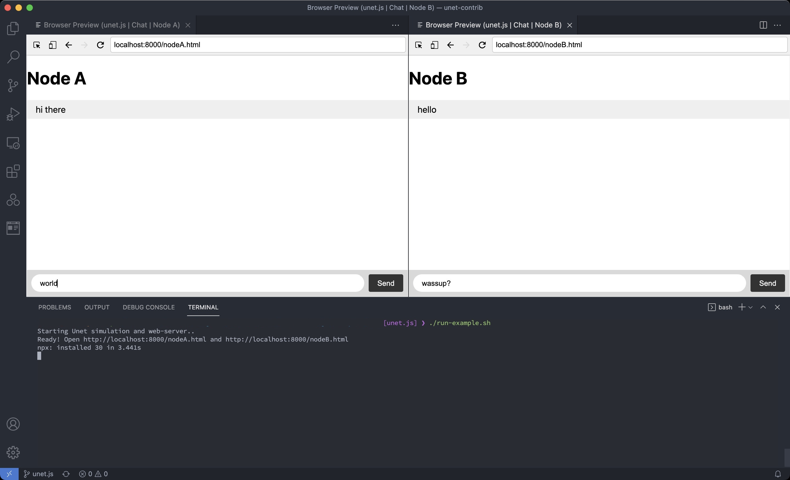

Example chat application using UnetSockets from unet.js
===================

This example implements a very simple chat application over a Unet using UnetSockets from unet.js.



## Usage

1. Build the unet.js package using

```sh
# inside js directory
npm install
npm run build
```

2. Run the `2-node-des.groovy` Unet simulator script. This will setup a Unet simulator with 2 nodes (`A` and `B`).

```sh
# inside examples/esm directory
./run-example.sh
```

3. Access browser based apps connected to node `A` at http://localhost:8000/nodeA.html

4. Access browser based apps connected to node `B` at http://localhost:8000/nodeB.html